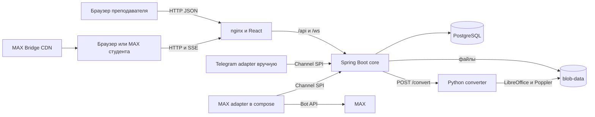

# Lecturer Assistant v2

Lecturer Assistant помогает преподавателю вести очную лекцию с синхронным экраном студента: показывать текущий слайд, получать сигналы понимания и вопросы, запускать короткие опросы. Преподаватель работает в веб-интерфейсе на компьютере, студент — в браузере или мини-приложении MAX.

Документ описывает состояние ветки `v2/phase-5-web-student-channel` на 24.09.2026, ревизия `bb4386a`. Веб-сценарий, сигналы по слайдам и полный цикл короткого опроса реализованы в коде; MAX-адаптер входит в compose. Сквозной путь с живым ботом и временным ngrok-стендом ещё не зафиксирован ручным прогоном. Ограничения перечислены ниже.

## Назначение и пользователи

Продукт рассчитан на преподавателя и студентов одной учебной группы во время лекции.

- Преподаватель создаёт курс, загружает PDF, PPT, PPTX или ODP, создаёт лекцию и запускает живую сессию.
- Студент подключается по шестизначному коду или ссылке, видит текущий слайд, отправляет один из трёх сигналов понимания, задаёт вопрос и отвечает на быстрый опрос.
- Преподаватель видит подключившихся студентов, текущее распределение сигналов, открытые вопросы и результаты опроса.

Система также содержит роли `ADMIN`, `LECTURER`, `ASSISTANT` и `STUDENT`, приглашения, группы, архивирование курсов и материалов, банк вопросов и API движка активностей. Не все серверные возможности подключены к основному интерфейсу.

## Основной пользовательский сценарий

Реализованный сценарий в текущем коде:

1. Преподаватель входит по email и паролю, открывает курс и загружает презентацию.
2. После завершения конвертации преподаватель создаёт лекцию из презентации и нажимает «Старт».
3. В презентере появляется код подключения. Кнопка «Подключение» открывает отдельное окно с QR-кодом и веб-ссылкой.
4. Студент открывает ссылку в другом браузере или на телефоне, вводит отображаемое имя и нажимает «Подключиться».
5. Переключение слайда в презентере передаётся студенту через Server-Sent Events. Окно проектора получает обновления через WebSocket и `BroadcastChannel`.
6. Студент нажимает «Понятно», «Есть вопрос» или «Не понимаю». Преподаватель видит последнее значение каждого участника в общей сводке.
7. Студент отправляет текстовый вопрос. Он появляется во вкладке «Вопросы» у преподавателя.
8. Преподаватель запускает быстрый опрос. Сервер принимает первый ответ студента, скрывает распределение до закрытия и сохраняет закрытый результат. Текущий экран студента ещё не согласован с новым контрактом API и после выбора варианта может завершиться ошибкой отображения.
9. Преподаватель ставит лекцию на паузу, продолжает её или завершает.

MAX-часть загружает Bridge с CDN MAX, передаёт `initData` серверу, получает JWT и по `start_param` вида `ABC123` открывает `#/s/ABC123`. Сервер проверяет HMAC-подпись и срок `auth_date`, затем находит или создаёт пользователя по MAX `user.id`; повторный вход использует того же человека, а сигналы, вопросы и ответы на опрос принимаются по JWT. `adapters/max` принимает `/start` и `bot_started` через long polling или webhook и отвечает кнопкой `open_app` с `?startapp=<код>`. Адаптер входит в compose, но путь «живой бот → временный ngrok → мини-приложение» ещё не подтверждён сквозным прогоном.

## Архитектура



Основные компоненты:

| Компонент | Реализация | Ответственность |
|---|---|---|
| `core/` | Java 21, Spring Boot 3.5.15, JDBC, Spring Security, Flyway | IAM, курсы, контент, живые сессии, обратная связь, вопросы, опросы, канальный SPI и события |
| `web/` | React 18, TypeScript, Vite 6, TanStack Query, Radix UI, nginx | Интерфейсы преподавателя и студента, презентер, проектор, MAX Bridge |
| `deploy/converter/` | Python 3.12, LibreOffice, Poppler | Проверка и преобразование PDF, PPT, PPTX и ODP в PNG слайдов и извлечение текста |
| `postgres` | PostgreSQL 16 | Пользователи, курсы, лекции, сессии, сигналы, вопросы, опросы, события |
| `adapters/telegram/` | Node.js без внешних npm-зависимостей | Экспериментальный long-poll адаптер Telegram; запускается отдельно |
| `adapters/max/` | Node.js без внешних npm-зависимостей | Long polling или webhook MAX, `/start`, `bot_started`, кнопка `open_app` и доставка из Channel SPI; входит в compose |
| `adapters/echo/` | Node.js без внешних npm-зависимостей | Консольная заглушка для проверки Channel SPI |

Ядро — модульный монолит. Границы модулей и решения описаны в [архитектуре](docs/ARCHITECTURE_V2.md), [ADR](docs/adr/) и [модели прав](docs/permissions.md). Контракт HTTP API находится в [OpenAPI](openapi/lecturer-assistant-v2.yaml).

## Запуск одной командой

Нужны Docker Engine и Docker Compose v2. Локальные Java, Maven, Node.js, Python, LibreOffice и PostgreSQL для базового запуска не нужны: они находятся в образах.

Из корня репозитория:

```sh
docker compose up --build
```

Команда собирает и запускает PostgreSQL, `core`, конвертер, веб-интерфейс, MAX- и Telegram-адаптеры. Без токена соответствующий адаптер остаётся в ожидающем контейнере и не мешает веб-сценарию. После запуска откройте `http://localhost:3000`.

Значения по умолчанию подходят только для локальной проверки. Для стенда создайте `.env` из `.env.example`, замените пароли и секреты и задайте `MAX_BOT_TOKEN`. Файл `.env` исключён из Git.

Последний документированный холодный замер находится в `deploy/BUILD_TIME.md`: 24.09.2026 образы `core`, конвертера и адаптеров собрались за 57 секунд, web отдельно — за 22 секунды, суммарно около 1 минуты 20 секунд. Базовые образы были прогреты, внутренний build-кэш очищен. Web в том замере собирался на более ранней ревизии; production-сборка текущего `bb4386a` проверена отдельно и проходит. Результат зависит от скорости сети и не заменяет контрольный холодный замер финального commit hash.

## Переменные окружения

Ниже приведена построчная сверка корневого `.env.example`, `core/src/main/resources/application.yml`, compose-файлов и процессов адаптеров. Значения по умолчанию предназначены для разработки; секреты стенда создаёт `deploy/stand/init-env.sh` и в Git не добавляет.

### Core: все переменные из `application.yml`

| Переменная | Дефолт приложения | В корневом `.env.example` | Фактическое использование |
|---|---|:---:|---|
| `DB_URL` | `jdbc:postgresql://localhost:5432/lecturer_assistant` | да | Compose передаёт адрес `postgres:5432` |
| `DB_USERNAME` | `lecturer` | да | Пользователь JDBC |
| `DB_PASSWORD` | `lecturer_dev_password` | да | Пароль JDBC; в prod берётся из `POSTGRES_PASSWORD` |
| `MAX_UPLOAD_SIZE` | `100MB` | да | Лимит одного multipart-файла и запроса Spring |
| `SERVER_PORT` | `8080` | нет | В контейнере compose жёстко задан `8080`; хостовый порт меняет `CORE_PORT` |
| `APP_VERSION` | `0.0.1-SNAPSHOT` | нет | Возвращается в системной информации; compose допускает переопределение |
| `JWT_SECRET` | небезопасный dev-дефолт | да | Подпись JWT; prod-оверлей требует непустое значение |
| `REQUIRE_STRONG_JWT_SECRET` | `false` | да | Prod-оверлей принудительно задаёт `true` |
| `ACCESS_TOKEN_MINUTES` | `15` | да | Срок access token |
| `REFRESH_TOKEN_DAYS` | `30` | да | Срок refresh token |
| `REFRESH_COOKIE_SECURE` | `true` | да | `Secure` для refresh-cookie; на локальном HTTP может понадобиться `false` |
| `BLOB_ROOT` | `./data/blobs` | да | В контейнере зафиксирован `/data/blobs` |
| `MAX_UPLOAD_BYTES` | `104857600` | да | Прикладной предел загрузки, 100 MiB |
| `SLIDE_IMAGE_URL_SECRET` | значение `JWT_SECRET` | нет | Подпись URL изображений; в базовом compose имеет отдельный dev-дефолт, в prod обязательна |
| `SLIDE_IMAGE_URL_TTL` | `PT1H` | нет | Срок окна подписи URL слайда |
| `CONVERTER_CONNECT_TIMEOUT` | `PT5S` | нет | Таймаут соединения core с конвертером |
| `CONVERTER_READ_TIMEOUT` | `PT20M` | нет | Таймаут чтения потока конвертации |
| `CONTENT_IMPORT_CORE_POOL_SIZE` | `1` | нет | Основное число потоков импорта |
| `CONTENT_IMPORT_MAX_POOL_SIZE` | `2` | нет | Максимальное число потоков импорта |
| `CONTENT_IMPORT_QUEUE_CAPACITY` | `8` | нет | Ёмкость очереди импорта |
| `MAX_BOT_TOKEN` | пусто | да | Проверка подписи MAX `initData`; также используется адаптером |
| `MAX_INIT_DATA_MAX_AGE` | `PT1H` | да | Максимальный возраст `initData` |
| `CHANNEL_INTERNAL_API_KEY` | небезопасный dev-дефолт | да | Ключ Channel SPI; compose передаёт его core и адаптерам, prod требует значение |
| `CHANNEL_DELIVERY_WORKER_DELAY_MS` | `5000` | да | Интервал чтения outbox |
| `TELEGRAM_BOT` | пусто | нет | Имя Telegram-бота в конфигурации каналов |
| `VK_BOT` | пусто | нет | Имя VK-бота в конфигурации каналов |

Итого: в `application.yml` используются 26 переменных, из них 11 отсутствуют в корневом `.env.example`: `SERVER_PORT`, `APP_VERSION`, `SLIDE_IMAGE_URL_SECRET`, `SLIDE_IMAGE_URL_TTL`, `CONVERTER_CONNECT_TIMEOUT`, `CONVERTER_READ_TIMEOUT`, `CONTENT_IMPORT_CORE_POOL_SIZE`, `CONTENT_IMPORT_MAX_POOL_SIZE`, `CONTENT_IMPORT_QUEUE_CAPACITY`, `TELEGRAM_BOT`, `VK_BOT`.

### Compose, стенд, адаптеры и web

| Переменная | Дефолт | Где читается | В корневом `.env.example` |
|---|---|---|:---:|
| `POSTGRES_DB` | `lecturer_assistant` | PostgreSQL и backup | да |
| `POSTGRES_USER` | `lecturer` | PostgreSQL и backup | да |
| `POSTGRES_PASSWORD` | dev-пароль | PostgreSQL; в prod обязательна | да |
| `POSTGRES_PORT` | `5432` | Публикация PostgreSQL на `127.0.0.1` | нет |
| `CORE_PORT` | `8080` | Хостовый порт core | да |
| `WEB_PORT` | `3000` | Хостовый порт web | да |
| `CLOUDFLARED_TOKEN` | пусто | Не читается кодом или compose; зарезервированная запись | да |
| `SITE_DOMAIN` | нет | Prod Caddy и URL мини-приложения/webhook | нет |
| `ACME_EMAIL` | нет | Регистрация сертификата Caddy | нет |
| `BACKUP_KEEP_DAYS` | `14` | Срок хранения `pg_dump` на стенде | нет |
| `MAX_WEBAPP_URL` | нет | MAX-адаптер; compose передаёт значение, prod строит из `SITE_DOMAIN` | нет |
| `MAX_API_BASE` | `https://platform-api2.max.ru` | MAX-адаптер при прямом запуске | нет |
| `MAX_WEBHOOK_URL` | пусто | Переключает MAX-адаптер с long polling на webhook | нет |
| `MAX_WEBHOOK_SECRET` | пусто | Проверка заголовка webhook; в prod обязательна | нет |
| `MAX_WEBHOOK_PORT` | `8090` | MAX-адаптер; в compose зафиксирован `8090` | нет |
| `MAX_WEBHOOK_PATH` | хеш токена | Путь webhook; в prod создаётся `init-env.sh` | нет |
| `MAX_RATE_LIMIT_RPS` | `15` | Ограничитель запросов MAX-адаптера | нет |
| `CORE_URL` | `http://localhost:8080` | MAX- и Telegram-адаптеры; compose задаёт `http://core:8080` | нет |
| `TELEGRAM_BOT_TOKEN` | пусто | Telegram-адаптер | нет |
| `VITE_MAX_BOT_NAME` | плейсхолдер в `web/.env.example` | Build-time настройка MAX-ссылки и QR-кода | нет; есть только в `web/.env.example` |

`VITE_MAX_BOT_NAME` встраивается Vite во время сборки. Одного изменения серверной `.env` после сборки недостаточно; web нужно пересобрать. Текущий `web/Dockerfile` не объявляет отдельный build argument, поэтому значение должно быть доступно Vite в контексте сборки.

### Конвертер

Все параметры ниже читаются `deploy/converter/server.py`, отсутствуют в `.env.example` и не передаются compose; сейчас используются дефолты кода.

| Переменная | Дефолт | Назначение |
|---|---:|---|
| `CONVERTER_MAX_SLIDES` | `300` | Максимум обрабатываемых слайдов |
| `CONVERTER_BASE_DPI` | `150` | Базовое разрешение рендера |
| `CONVERTER_LARGE_DECK_THRESHOLD` | `120` | Порог большой презентации по числу страниц |
| `CONVERTER_LARGE_FILE_BYTES` | `83886080` | Порог большого файла, 80 MiB |
| `CONVERTER_LARGE_DECK_DPI` | `110` | DPI для большой презентации |
| `CONVERTER_MAX_LONG_EDGE` | `1600` | Максимальная длинная сторона PNG |
| `CONVERTER_OFFICE_TIMEOUT_SECONDS` | `240` | Таймаут LibreOffice |
| `CONVERTER_OFFICE_QUEUE_TIMEOUT_SECONDS` | `600` | Ожидание слота LibreOffice |
| `CONVERTER_PAGE_TIMEOUT_SECONDS` | `60` | Таймаут обработки страницы |
| `CONVERTER_SOFFICE_CONCURRENCY` | `1` | Число одновременных процессов LibreOffice |
| `CONVERTER_ZIP_BOMB_RATIO` | `120` | Порог коэффициента распаковки архива |
| `CONVERTER_ZIP_BOMB_UNCOMPRESSED_BYTES` | `367001600` | Порог распакованного объёма, 350 MiB |

## Порты

| Порт | Доступ | Компонент |
|---:|---|---|
| `3000` | хост, изменяется через `WEB_PORT` | веб-интерфейс и reverse proxy к API |
| `8080` | хост, изменяется через `CORE_PORT` | REST API и WebSocket `core` |
| `5432` | только `127.0.0.1`, изменяется через `POSTGRES_PORT` | PostgreSQL |
| `8000` | только сеть compose | конвертер презентаций |
| `8090` | только сеть compose; при прямом запуске меняется через `MAX_WEBHOOK_PORT` | MAX-адаптер |
| `80`, `443` | prod-оверлей | Caddy с автоматическим TLS для `SITE_DOMAIN` |

Если 3000 или 8080 заняты:

```sh
WEB_PORT=13000 CORE_PORT=18080 docker compose up --build
```

Хостовый порт PostgreSQL можно изменить, например `POSTGRES_PORT=15432 docker compose up --build`.

## Зависимости

Зависимости фиксируются в следующих файлах:

- Java: `core/pom.xml`; базовый образ Maven — `maven:3.9.9-eclipse-temurin-21`, runtime — `eclipse-temurin:21-jre`.
- Web: `web/package.json` и `web/package-lock.json`; сборка выполняется через `npm ci` в `node:22-alpine`, runtime — `nginx:1.27-alpine`.
- База: `postgres:16-alpine`.
- Конвертер: `python:3.12-slim`, пакеты Debian `libreoffice`, `poppler-utils`, `fonts-dejavu`; их версии не зафиксированы.
- Prod-оверлей: `caddy:2.8-alpine` и `postgres:16-alpine` для резервного копирования.
- Tunnel-оверлей: `cloudflare/cloudflared:2025.2.1`.

Полный список Java- и npm-библиотек находится в соответствующих manifest-файлах. Maven Wrapper отсутствует. У Node-адаптеров нет `package.json`, потому что они используют только встроенные модули Node.js и `fetch`.

## Внешние сервисы и интеграции

| Интеграция | Что реализовано | Что требуется для работы |
|---|---|---|
| MAX Web App | Bridge подключается как `https://st.max.ru/js/max-web-app.js`; читаются `initData`, `start_param`, тема, viewport и BackButton; сервер проверяет подпись и выдаёт JWT | Зарегистрированное мини-приложение, HTTPS-адрес веба и `MAX_BOT_TOKEN` |
| MAX Bot API | `adapters/max` входит в compose и поддерживает long polling и webhook, `/start`, `bot_started`, кнопку `open_app`, регистрацию возможностей и доставку из outbox | `MAX_BOT_TOKEN`, `MAX_WEBAPP_URL`; для webhook — публичный HTTPS, secret и маршрутизация через Caddy. С живым API сквозной путь не проверен |
| Telegram Bot API | Минимальный long-poll адаптер входит в compose | `TELEGRAM_BOT_TOKEN`; без токена контейнер ожидает, не запуская адаптер |
| VK | В конфигурации канала есть имя бота | Внешнего адаптера нет |
| Cloudflare quick tunnel | Оверлей направляет публичный tunnel на `web:80` | `docker compose -f docker-compose.yml -f docker-compose.tunnel.yml --profile tunnel up` |
| Caddy | Reverse proxy для `/api/*`, `/ws/*`, webhook MAX и web; автоматически получает TLS-сертификат | Prod-оверлей, `SITE_DOMAIN` и `ACME_EMAIL` |
| ngrok | Временно предоставляет HTTPS-адрес текущего стенда | URL меняется при перезапуске и не хранится в репозитории; перед отправкой его нужно проверить и сообщить отдельно |

## Данные и тестовые данные

Внешние датасеты и данные для обучения моделей не используются. Система обрабатывает:

- аккаунты: отображаемое имя, email, роль, статус, хеш пароля;
- MAX-идентичность: числовой `user.id`, имя, фамилию и username из подписанного `initData`; в БД сохраняются внешний ID, display hint и сгенерированный локальный email вида `max-<id>@max.local`;
- структуру обучения: курсы, участники, группы и приглашения;
- материалы: исходные презентации, PNG слайдов, извлечённый текст, заметки и вложения;
- живую лекцию: код входа, текущий слайд, аннотации, участники и журнал переходов;
- обратную связь: последнее значение сигнала участника для каждого слайда, вопросы и ответы на опросы;
- технические события и refresh-токены; в БД сохраняются только хеши refresh-токенов и токенов анонимного участника.

Метаданные находятся в PostgreSQL volume `postgres-data`, файлы — в `blob-data`. Access token хранится в `sessionStorage` браузера, refresh token — в `HttpOnly` cookie.

Тестовых данных и тестовых учётных записей в репозитории нет. База после первого запуска пустая. Первый пользователь создаётся на вкладке «Первый запуск» и получает роль `ADMIN`; повторный bootstrap блокируется. Учётные записи из интеграционных тестов не создаются в рабочей базе и не являются данными стенда.

Перед сдачей владелец должен отдельно подготовить тестовые учётные записи `ADMIN`, `LECTURER` и `ASSISTANT`, тестовый аккаунт MAX для роли `STUDENT`, курс, презентацию, лекцию и вопросы. В документации указываются только адреса учётных записей; пароли передаются жюри по закрытому каналу.

## Проверка после запуска

### 1. Состояние сервисов

```sh
docker compose ps
curl http://localhost:8080/api/v1/system/info
```

Ожидаемый результат: контейнеры `postgres`, `core`, `converter` и `web` запущены; API отвечает JSON:

```json
{"name":"lecturer-assistant-v2","version":"0.0.1-SNAPSHOT","status":"BOOTSTRAPPED"}
```

### 2. Первый вход и курс

1. Откройте `http://localhost:3000`.
2. На вкладке «Первый запуск» создайте администратора.
3. Нажмите «+ Создать курс», введите название и откройте курс.

Ожидаемый результат: после bootstrap открывается раздел «Курсы»; новый курс появляется в списке. Если база уже содержит пользователей, bootstrap возвращает конфликт, и нужно войти существующей учётной записью.

### 3. Презентация и лекция

1. В курсе откройте «Материалы».
2. Задайте название и загрузите небольшой PDF, PPT, PPTX или ODP до 100 MB.
3. Дождитесь статуса завершения импорта.
4. В разделе «Лекции» укажите название, выберите презентацию и нажмите «Создать», затем «Старт».

Ожидаемый результат: показывается прогресс импорта, затем дек со слайдами; кнопка «Старт» открывает презентер со статусом живой сессии и кодом подключения.

### 4. Два устройства

1. На компьютере преподавателя в презентере нажмите «Подключение».
2. На телефоне или во втором приватном окне откройте веб-ссылку из вкладки «Веб».
3. Введите имя из двух или более символов и нажмите «Подключиться».

Ожидаемый результат: студент видит текущий слайд; в презентере счётчик участников увеличивается, а имя появляется во вкладке «Студенты».

### 5. Синхронизация и обратная связь

1. На компьютере нажмите «Далее».
2. На устройстве студента нажмите «Не понимаю».
3. Отправьте текстовый вопрос.

Ожидаемый результат: слайд студента меняется без перезагрузки; в сводке преподавателя появляется один красный сигнал, а во вкладке «Вопросы» — новый вопрос.

### 6. Быстрый опрос

1. В презентере нажмите «Опрос».
2. Введите вопрос и не менее двух вариантов, затем нажмите «Запустить опрос».
3. На устройстве студента выберите вариант.
4. На компьютере отметьте правильный вариант и нажмите «Закрыть и показать результат».

Ожидаемый результат: первый ответ принимается, повторный не изменяет выбор; до закрытия студент видит сохранённый вариант без распределения и правильного ответа; после закрытия появляются распределение, правильный вариант и собственный ответ студента. Core-тесты и production-сборка web проходят; ручной двухустройственный прогон нужно выполнить перед сдачей.

### 7. Завершение

В презентере нажмите «Завершить» и подтвердите действие.

Ожидаемый результат: сессия получает статус `ENDED`, отправка сигналов, вопросов и ответов становится недоступна.

Подробный сценарий для жюри: [docs/hackathon/JURY_WALKTHROUGH.md](docs/hackathon/JURY_WALKTHROUGH.md).

## Известные ограничения

- MAX-адаптер входит в compose и реализует long polling, webhook, `/start`, `bot_started`, `open_app` и чтение outbox, но сквозной прогон с живым Bot API не зафиксирован. Core пока не создаёт в outbox итоговые сообщения, поэтому после лекции бот ничего не рассылает.
- MAX-вход, повторная идентификация, переход по `start_param`, сигналы и вопросы по JWT реализованы на сервере и покрыты интеграционными тестами, но не зафиксирован ручной прогон в реальном webview MAX.
- Экран «Подключение» строит ссылку и QR-код `max.ru/<бот>?startapp=<код>` только если `VITE_MAX_BOT_NAME` был задан при сборке; в `web/.env.example` пока стоит плейсхолдер.
- Сигналы привязаны к слайдам и история проблемных слайдов формируется; поведение подтверждено интеграционным тестом, но не нагрузочным прогоном.
- Сервер хранит статусы и текст ответа на вопрос, но интерфейс преподавателя показывает только открытые вопросы и не даёт ответить или закрыть их.
- Привязка MAX-аккаунта к преподавателю находится в работе и отсутствует в текущей базовой ревизии.
- Тестовых данных, seed-скрипта и готовых тестовых учётных записей нет.
- Новое приватное окно без сохранённого токена создаёт нового временного участника. Временный участник больше не добавляется в постоянный состав курса; возврат в том же окне использует сохранённый токен.
- Корневой `.env.example` не перечисляет 11 переменных core, параметры стенда и адаптеров, build-time `VITE_MAX_BOT_NAME` и настройки конвертера; полный реестр приведён выше.
- Последний холодный замер укладывается в пять минут, но web измерялся на более ранней ревизии, а время заметно зависит от сети; нужен финальный замер на commit hash отправки.
- Текущий публичный адрес выдаёт ngrok и меняется после перезапуска; постоянный домен не подтверждён.
- OpenAPI не содержит `GET /api/v1/config/channels`; пути `/internal/v1/**` записаны относительно общего `servers.url: /api/v1` и требуют исправления или отдельного server block.
- Сценарий k6 на 150 SSE-клиентов существует, но сохранённого результата прогона нет. Ручной прогон в мобильной, веб- и desktop-версиях MAX также не зафиксирован. Интервью с преподавателями и пилот не проведены.

## Остановка и повторный запуск

Если compose работает в текущем терминале, остановите его `Ctrl+C`. Контейнеры можно удалить командой:

```sh
docker compose down
```

Volumes `postgres-data` и `blob-data` сохраняются. Повторный запуск использует прежние аккаунты, курсы и файлы:

```sh
docker compose up --build
```

Для перезапуска без пересборки:

```sh
docker compose restart
```

Полный сброс локальных данных удаляет оба volume и необратимо стирает локальную базу и загруженные файлы:

```sh
docker compose down -v
```

После полного сброса снова доступна вкладка «Первый запуск».
