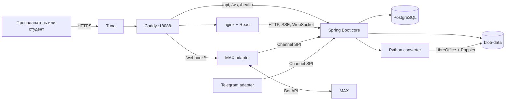

# Lecturer Assistant v2

Lecturer Assistant — веб-приложение для обратной связи во время очной лекции. Преподаватель показывает презентацию с компьютера, а студенты в браузере или мини-приложении MAX видят текущий слайд, отправляют сигнал понимания, задают вопросы и отвечают на короткие опросы.

Документ описывает состояние текущей рабочей ветки после backend-коммита `0b8813b` и frontend-исправлений до `dc4a5ef`; релизный hash сдачи ещё не зафиксирован. Текущий стенд: [https://lecturer-assistant.ru.tuna.am](https://lecturer-assistant.ru.tuna.am). На стенде развёрнуты backend `0b8813b` и web `dc4a5ef`: core и web healthy, `/health` отвечает 200. Авторизованный browser-smoke подтвердил быстрый запуск, паузу/продолжение, закрытие проектора, итог с раздельным активным временем и временем паузы, аналитику и изменение порядка слайдов. Владелец проверил в живом MAX вход преподавателя через одноразовый код; полный студенческий сценарий должен быть пройден отдельно и оформлен протоколом.

## Назначение и пользователи

- Преподаватель создаёт курс, загружает и редактирует PDF, PPT, PPTX или ODP, создаёт лекцию и запускает её из карточки курса.
- Студент подключается по шестизначному коду или через MAX, видит текущий слайд, отправляет один из трёх сигналов, вопрос или ответ на опрос.
- Преподаватель видит участников, сигналы, вопросы, результаты проверок, историю лекций и аналитику по группам и студентам.
- Администратор создаёт приглашения и управляет пользователями; роль ассистента предусмотрена моделью доступа.

## Основной пользовательский сценарий

1. Преподаватель входит по email и паролю, открывает тестовый курс и запускает подготовленную лекцию прямо с карточки курса.
2. Презентер показывает первый слайд и шестизначный код. В верхней панели доступны «Подключить студентов», меню «Инструменты», кнопки «Пауза» и «Завершить»; проектор открывается из «Инструментов».
3. Студент открывает мини-приложение из MAX или резервный веб-адрес `http://localhost:<WEB_PORT>/#/s/<код>` и подключается.
4. Смена слайда поступает студенту через SSE; проектор синхронизируется через WebSocket и `BroadcastChannel`.
5. Сигнал «Понятно», «Есть вопрос» или «Не понимаю» сохраняется для конкретного участника и слайда. Текстовый вопрос появляется у преподавателя.
6. Преподаватель запускает подготовленный вопрос из банка или создаёт быстрый опрос. Первый ответ студента фиксируется, распределение скрыто до закрытия; после закрытия показываются результат, правильный вариант и собственный ответ студента.
7. На паузе действия преподавателя и студента блокируются, а время паузы не входит в активную длительность. После завершения открытое приложением окно проектора закрывается; если браузер запретил автоматическое закрытие, на экране остаётся кнопка возврата. Преподавателю открывается итог с участниками, сигналами, проблемными слайдами, проверками и числом вопросов без ответа.

MAX Bridge передаёт серверу `initData` и `start_param`. Сервер проверяет HMAC-подпись и возраст `auth_date`, выдаёт JWT и повторно использует личность для того же MAX `user.id`. Преподаватель может получить одноразовый код на странице «Подключить MAX», привязать MAX-аккаунт к своей учётной записи и из мини-приложения вернуться в свою активную лекцию. Серверная и клиентская части этого пути слиты; владелец подтвердил вход преподавателя через код в живом MAX. Это не заменяет отдельный двухустройственный протокол студента: вход по ссылке, слайд, сигнал, вопрос и опрос ещё должны быть зафиксированы одним прогоном.

## Архитектура



| Компонент | Реализация | Ответственность |
|---|---|---|
| `core/` | Java 21, Spring Boot 3.5.15, JDBC, Spring Security, Flyway | IAM, курсы, группы, материалы, live-сессии, взаимодействия, учебная аналитика, Channel SPI |
| `web/` | React 18, TypeScript, Vite 6, nginx | Интерфейсы преподавателя и студента, презентер, проектор, MAX Bridge |
| `deploy/converter/` | Python 3.12, LibreOffice Impress, Poppler | Проверка и преобразование презентаций в PNG, извлечение текста |
| `postgres` | PostgreSQL 16 | Метаданные и взаимодействия пользователей |
| `adapters/max/` | Node.js 22, стандартная библиотека | Long polling/webhook MAX, `open_app`, Channel SPI outbox |
| `adapters/telegram/` | Node.js 22, стандартная библиотека | Минимальный long-poll адаптер Telegram |

Ядро организовано как модульный монолит. Дополнительные материалы: [архитектура](docs/ARCHITECTURE_V2.md), [ADR](docs/adr/), [модель прав](docs/permissions.md), [OpenAPI](openapi/lecturer-assistant-v2.yaml).

## Запуск одной командой

Нужны Docker Engine и Docker Compose v2. Из корня репозитория:

```sh
docker compose up --build
```

Запускаются шесть постоянных контейнеров: `postgres`, `core`, `converter`, `web`, `max-adapter`, `telegram-adapter`. Если токен MAX или Telegram не задан, соответствующий адаптер пишет сообщение в лог и остаётся ждать; остальные сервисы работают. Веб-интерфейс по умолчанию: `http://localhost:3000`.

Все три публикуемых порта можно изменить одной командой:

```sh
WEB_PORT=13000 CORE_PORT=18080 POSTGRES_PORT=15432 docker compose up --build
```

Контрольный прогон 25.09.2026 на чистом клоне ревизии `12856ce`: `docker compose build --no-cache` успешно собрал все пять образов, включая production-образ web, за 59,24 с. Базовые образы были локальными, BuildKit-кэш отключён; условия, smoke и повторный идемпотентный seed зафиксированы в `deploy/BUILD_TIME.md`. Замер нужно повторить на финальном hash.

## Переменные окружения

Полный исполняемый образец — [`.env.example`](.env.example). Скопируйте его в `.env`; реальные секреты в Git не добавляются. Таблица ниже построчно соответствует текущему `.env.example` и `application.yml`.

| Переменная | Значение в образце / дефолт | Назначение |
|---|---|---|
| `POSTGRES_DB` | `lecturer_assistant` | Имя базы PostgreSQL |
| `POSTGRES_USER` | `lecturer` | Пользователь PostgreSQL |
| `POSTGRES_PASSWORD` | пусто; локальный compose подставляет dev-пароль | Пароль PostgreSQL; обязателен на стенде |
| `DB_URL` | `jdbc:postgresql://postgres:5432/lecturer_assistant` | JDBC URL для core |
| `DB_USERNAME` | `lecturer` | Пользователь JDBC |
| `DB_PASSWORD` | пусто; локально dev-пароль | Пароль JDBC; должен совпадать с паролем БД |
| `WEB_PORT` | `3000` | Порт веб-интерфейса на хосте |
| `CORE_PORT` | `8080` | Порт core на `127.0.0.1` |
| `POSTGRES_PORT` | `5432` | Порт PostgreSQL на `127.0.0.1` |
| `JWT_SECRET` | пусто; локально dev-ключ | Подпись JWT; на стенде не короче 32 символов |
| `REQUIRE_STRONG_JWT_SECRET` | `false` | Запрет старта со слабым JWT-ключом; prod принудительно `true` |
| `SLIDE_IMAGE_URL_SECRET` | пусто; локально dev-ключ | Подпись временных URL изображений слайдов |
| `SLIDE_IMAGE_URL_TTL` | `PT1H` | Срок действия URL слайда |
| `ACCESS_TOKEN_MINUTES` | `15` | Срок access token в минутах |
| `REFRESH_TOKEN_DAYS` | `30` | Срок refresh token в днях |
| `REFRESH_COOKIE_SECURE` | `true` | Флаг `Secure` refresh-cookie |
| `APP_CORS_ALLOWED_ORIGINS` | пусто; локально адреса `WEB_PORT` | Разрешённые HTTP/WebSocket origins; на стенде задаётся из домена |
| `RATE_LIMIT_AUTH_MAX_PER_MINUTE` | `120` | Лимит MAX-входов с одного IP в минуту |
| `RATE_LIMIT_SIGNAL_PER_MINUTE` | `120` | Лимит сигналов студента с одного IP в минуту |
| `MAX_BOT_TOKEN` | пусто | Токен MAX для проверки `initData` и работы адаптера |
| `VITE_MAX_BOT_NAME` | пусто | Публичное имя MAX-бота; build-time значение для ссылки и QR, после изменения web нужно пересобрать |
| `MAX_INIT_DATA_MAX_AGE` | `PT1H` | Допустимый возраст `initData` |
| `MAX_WEBAPP_URL` | пусто | Адрес мини-приложения для адаптера; на стенде выводится из домена |
| `MAX_WEBHOOK_URL` | пусто | URL webhook; пустое значение включает long polling |
| `MAX_WEBHOOK_SECRET` | пусто | Секрет заголовка webhook |
| `MAX_WEBHOOK_PATH` | пусто | Непредсказуемый путь webhook |
| `MAX_RATE_LIMIT_RPS` | `15` | Лимит запросов адаптера к MAX Bot API |
| `CHANNEL_INTERNAL_API_KEY` | пусто; локально dev-ключ | Общий ключ core, MAX- и Telegram-адаптеров |
| `CHANNEL_DELIVERY_WORKER_DELAY_MS` | `5000` | Интервал чтения outbox |
| `TELEGRAM_BOT` | пусто | Имя Telegram-бота для конфигурации каналов |
| `VK_BOT` | пусто | Имя VK-бота; отдельного адаптера VK нет |
| `TELEGRAM_BOT_TOKEN` | пусто | Токен Telegram-адаптера |
| `MAX_UPLOAD_BYTES` | `104857600` | Прикладной предел файла, 100 MiB |
| `MAX_UPLOAD_SIZE` | `100MB` | Multipart-лимит Spring |
| `CONVERTER_CONNECT_TIMEOUT` | `PT5S` | Таймаут соединения с конвертером |
| `CONVERTER_READ_TIMEOUT` | `PT20M` | Таймаут конвертации |
| `CONTENT_IMPORT_CORE_POOL_SIZE` | `1` | Основное число потоков импорта |
| `CONTENT_IMPORT_MAX_POOL_SIZE` | `2` | Максимальное число потоков импорта |
| `CONTENT_IMPORT_QUEUE_CAPACITY` | `8` | Размер очереди импорта |
| `APP_VERSION` | `0.0.1-SNAPSHOT` | Версия в `/api/v1/system/info` |
| `SEED_PASSWORD_ADMIN` | пусто | Пароль тестового администратора |
| `SEED_PASSWORD_LECTURER` | пусто | Пароль тестового преподавателя |
| `SEED_PASSWORD_ASSISTANT` | пусто | Пароль тестового ассистента |
| `SITE_DOMAIN` | пусто | Домен VPS; prod-оверлей использует его для Caddy, CORS и MAX URL |
| `ACME_EMAIL` | пусто | Email для Let's Encrypt на VPS |
| `PUBLIC_DOMAIN` | пусто | Постоянный адрес внешнего туннеля; сейчас `lecturer-assistant.ru.tuna.am` |
| `NGROK_DOMAIN` | пусто | Резервный статический домен ngrok; ngrok сейчас остановлен |
| `TUNNEL_PORT` | `18088` | Локальный порт Caddy для внешнего туннеля |
| `BACKUP_KEEP_DAYS` | `14` | Срок хранения резервных копий БД |

`SERVER_PORT=8080`, `BLOB_ROOT=/data/blobs`, внутренние `CORE_URL`, `MAX_WEBHOOK_PORT=8090` и URL конвертера зафиксированы compose и не являются пользовательскими настройками.

## Порты

| Порт | Доступ | Компонент |
|---:|---|---|
| `3000` | хост; `WEB_PORT` | web и reverse proxy к API |
| `8080` | только `127.0.0.1`; `CORE_PORT` | REST API и WebSocket core |
| `5432` | только `127.0.0.1`; `POSTGRES_PORT` | PostgreSQL |
| `8000` | только сеть compose | конвертер |
| `8090` | только сеть compose | webhook MAX-адаптера |
| `18088` | только `127.0.0.1`; `TUNNEL_PORT` | Caddy, на который смотрит Tuna/ngrok |
| `80`, `443` | VPS prod-оверлей | Caddy; HTTP/HTTPS и автоматический сертификат Let's Encrypt |

Prometheus и Grafana в текущем compose отсутствуют.

## Зависимости

- Java-зависимости: `core/pom.xml`; build image `maven:3.9.9-eclipse-temurin-21`, runtime `eclipse-temurin:21-jre`.
- Web: `web/package.json` и `web/package-lock.json`; `npm ci` в `node:22-alpine`, runtime `nginx:1.27-alpine`.
- PostgreSQL: `postgres:16-alpine`.
- Конвертер: `python:3.12-slim` по digest; Debian-пакеты `libreoffice-impress-nogui=4:25.2.*`, `poppler-utils=25.03.*`, `fonts-dejavu-core=2.37-*`. Версии зафиксированы до ветки Debian, что отдельно объяснено в `deploy/BUILD_TIME.md`.
- MAX- и Telegram-адаптеры: `node:22-alpine`, без внешних npm-пакетов.
- Prod: `caddy:2.8-alpine`; Prometheus, Grafana и cloudflared не используются.

## Внешние сервисы и интеграции

| Интеграция | Состояние |
|---|---|
| MAX Web App | Bridge, `initData`, `start_param`, тема, viewport и BackButton реализованы; подпись проверяется сервером. Вход преподавателя через код в живом MAX проверен владельцем; студенческий сценарий требует отдельного протокола |
| MAX Bot API | Публичный бот: `@t428_hakaton_max_bot`, ссылка — `https://max.ru/t428_hakaton_max_bot`. Бот выдан организаторами, модерация не требуется; webhook зарегистрирован на Tuna. Полный студенческий прогон не зафиксирован |
| Привязка преподавателя к MAX | Серверная и клиентская части слиты: одноразовый код на 5 минут, QR/ссылка, сохранение роли преподавателя и переход в активную лекцию. Живой вход через код проверен владельцем |
| Telegram Bot API | Адаптер в compose; без `TELEGRAM_BOT_TOKEN` ждёт и не мешает запуску |
| Tuna | Текущий постоянный HTTPS-адрес стенда. Внешний туннель направлен на Caddy `127.0.0.1:18088`; доступность зависит от машины и клиента Tuna |
| Caddy | На туннельном стенде маршрутизирует HTTP за внешним TLS; на VPS слушает 80/443 и получает сертификат Let's Encrypt |

## Данные и тестовые данные

Внешние датасеты и обучение моделей не используются. Система хранит аккаунты и роли; MAX `user.id` и отображаемые поля профиля; курсы, группы и материалы; исходные презентации, PNG и извлечённый текст; live-сессии, сигналы, вопросы, ответы на опросы и технические события. Аналитика рассчитывается по этим взаимодействиям. Пароли хешируются BCrypt, refresh-токены и токены анонимных участников хранятся как хеши.

После запуска создайте воспроизводимый тестовый набор:

```sh
docker compose run --rm seed
```

До команды задайте в `.env` три пароля `SEED_PASSWORD_*` длиной не менее восьми символов. Скрипт использует `deploy/seed/test-lecture.pptx` и создаёт или переиспользует:

| Роль | Логин | Пароль |
|---|---|---|
| Администратор | `admin@lecturer-assistant.test` | `SEED_PASSWORD_ADMIN`, передаётся закрытым каналом |
| Преподаватель | `lecturer@lecturer-assistant.test` | `SEED_PASSWORD_LECTURER`, передаётся закрытым каналом |
| Ассистент | `assistant@lecturer-assistant.test` | `SEED_PASSWORD_ASSISTANT`, передаётся закрытым каналом |

Также создаются курс `[ТЕСТ] Цифровые образовательные решения`, презентация и лекция `[ТЕСТ] Лекция 1. Обратная связь на лекции`, два вопроса в банке. Повторный запуск не дублирует найденные сущности. На уже заполненной вручную базе seed может остановиться, если пароль тестового администратора не совпадает.

## Проверка после запуска

### 1. Сервисы и API

```sh
docker compose ps
curl "http://localhost:${CORE_PORT:-8080}/api/v1/system/info"
```

Ожидается шесть сервисов. `postgres`, `core`, `converter` и `web` переходят в healthy; адаптеры запущены либо сообщают об отсутствующем токене и ждут. API возвращает JSON с `name: lecturer-assistant-v2` и `status: BOOTSTRAPPED`.

### 2. Тестовые данные и вход

1. Выполните `docker compose run --rm seed`.
2. Откройте `http://localhost:${WEB_PORT:-3000}`.
3. Войдите как `lecturer@lecturer-assistant.test`, используя пароль из `SEED_PASSWORD_LECTURER`.
4. Откройте тестовый курс и раздел «Материалы».

Ожидается подготовленная презентация и лекция. После seed вкладка «Первый запуск» уже неприменима: администратор создан.

### 3. Запуск лекции

У тестовой лекции нажмите «Старт». Ожидается презентер со статусом «В эфире», текущим слайдом и шестизначным кодом. Вверху должны быть «Показ», «Инструменты», «Пауза», «Завершить».

### 4. Подключение второго устройства

В текущем презентере нет отдельной кнопки «Подключение» и нет подтверждённой веб-ссылки на экране. Для MAX откройте `Показ → QR для MAX`. Для резервной веб-проверки на телефоне или во втором приватном окне откройте вручную:

```text
http://localhost:<WEB_PORT>/#/s/<шестизначный код>
```

Введите имя `Жюри Студент` и нажмите «Подключиться». Ожидается текущий слайд, участник в списке преподавателя и счётчик 1. Отсутствие видимой веб-ссылки в презентере остаётся открытым UX-вопросом к frontend.

### 5. Слайд, сигнал и вопрос

1. На компьютере нажмите «Далее».
2. На устройстве студента нажмите «Не понимаю».
3. Отправьте вопрос `Можно ещё раз объяснить этот шаг?`.

Ожидается синхронный слайд без перезагрузки, красный сигнал у преподавателя и новый вопрос во вкладке «Вопросы».

### 6. Вопрос из банка

1. Нажмите «Опрос», откройте вкладку «Из банка» и выберите `[ТЕСТ] Что видит преподаватель после закрытия быстрого опроса?`.
2. На устройстве студента выберите «Распределение ответов студентов».
3. Убедитесь, что у преподавателя показан один ответ.
4. Нажмите «Закрыть и показать результат»: правильный вариант уже задан в банке.

Ожидается: первый ответ сохранён; до закрытия студент видит свой выбор без распределения; после закрытия оба интерфейса показывают распределение и правильный вариант, студент — свой ответ. Интерфейсный цикл опроса проверен упаковкой 24.09; core-тесты и production-сборка web проходят.

### 7. Завершение

Нажмите «Завершить» и подтвердите. Ожидается статус `ENDED`; сигналы, вопросы и ответы становятся недоступны. У преподавателя открывается итог лекции с основными показателями, проблемными слайдами и результатами проверок.

Полный двухустройственный сценарий: [docs/hackathon/JURY_WALKTHROUGH.md](docs/hackathon/JURY_WALKTHROUGH.md).

## Надёжность стенда

Текущий демонстрационный стенд доступен по постоянному адресу [https://lecturer-assistant.ru.tuna.am](https://lecturer-assistant.ru.tuna.am). Tuna направляет внешний HTTPS-трафик на локальный Caddy `127.0.0.1:18088`; Caddy маршрутизирует web, API, WebSocket и MAX webhook. ngrok остановлен и в текущем маршруте не используется.

Сторож стенда устанавливается командой:

```sh
sh deploy/stand/watch-install.sh
```

После установки launchd запускает проверку каждые 300 секунд. Сторож проверяет публичный адрес и локальный Caddy, различает отказ контейнеров и внешнего туннеля, при необходимости перезапускает только compose-проект `lecturer-stand`, а также контролирует свежесть резервной копии. Каждая проверка записывается с меткой времени в `deploy/stand/check.log`; диагностический вывод процессов — в `deploy/stand/watch.out`. На macOS уведомление отправляется один раз при обнаружении сбоя и один раз после восстановления.

Проверить состояние или удалить сторож:

```sh
sh deploy/stand/watch-install.sh status
sh deploy/stand/watch-install.sh remove
```

Сторож повышает эксплуатационную устойчивость, но не устраняет зависимость стенда от питания, режима сна, сети и запущенного клиента Tuna на машине владельца.

25.09 создана согласованная локальная пара резервных копий PostgreSQL и `blob-data`. Dump восстановлен в отдельную временную БД с совпадением контрольных счётчиков, архив файлов успешно прочитан. По решению владельца пара остаётся только на текущем хосте и не переносится во внешнее хранилище.

## Граница до заморозки и дальнейшее развитие

В коде реализованы итог и история лекций, история проверок, быстрый запуск, реальная пауза, закрытие проектора, изменение порядка и удаление слайдов с сохранением snapshot начатой сессии, группы и аналитика по группам/студентам. Контроль 25.09: backend 111/111 тестов, MAX-адаптер 16/16, web lint без ошибок и production build успешен. Полный ручной MAX-протокол на двух устройствах всё ещё обязателен.

После сдачи остаются персональный конспект студента, телефонный пульт преподавателя, исторический snapshot состава групп, междисциплинарные/семестровые сравнения и интеграция с LMS. Подробная граница зафиксирована в [PRODUCT_DEVELOPMENT.md](docs/hackathon/PRODUCT_DEVELOPMENT.md) и разделе 4 [ROADMAP.md](docs/hackathon/ROADMAP.md).

## Известные ограничения

- Вход преподавателя через одноразовый код в живом MAX проверен владельцем, но отдельного протокола полного студенческого сценария на двух устройствах пока нет. Web-MAX дошёл только до экрана входа; слайд, сигнал и вопрос проверялись через публичный web API, а опрос и результат — на production bundle с mock API. Эти проверки не заменяют живой MAX-прогон.
- На Tuna-стенде backend `0b8813b` + web `dc4a5ef` healthy и прошли авторизованный browser-smoke, включая раздельное время «в эфире» и «на паузе» в итоге. Новый интерфейс материалов и меню перемещения слайдов проверены на стенде. Browser-smoke не заменяет полный MAX-протокол.
- `VITE_MAX_BOT_NAME` встраивается во время web-сборки. Без него окно подключения студентов показывает только код и сообщение о ненастроенном боте.
- На публичном стенде 25.09 прошли web-подключение по тестовому коду, сигнал «Есть вопрос» и отправка вопроса без предупреждений или ошибок консоли. Активного опроса в этом smoke не было; проверка не подтверждает MAX-интеграцию.
- В презентере нет видимой резервной веб-ссылки; прямой маршрут `/#/s/<код>` подтверждён кодом, но способ его выдачи пользователю нужно согласовать с frontend.
- Core не создаёт итоговое сообщение лекции в outbox, поэтому бот не рассылает итоги после завершения.
- Интерфейс преподавателя показывает открытые вопросы, но не позволяет ответить или закрыть вопрос.
- Новый приватный браузер без сохранённого токена создаёт нового временного участника.
- Для прошлых лекций аналитика относит постоянного студента к его текущей группе; исторического snapshot состава групп нет. Временные гости учитываются отдельно и не становятся постоянными профилями.
- Аналитика показывает посещения, сигналы, ответы и вопросы. Детекции списывания по косвенным признакам нет.
- Стенд имеет постоянный адрес, но работает через Tuna Desktop на машине владельца; доступность зависит от питания, сна, сети, клиента Tuna и тарифа. Для периода оценки предусмотрен перенос на VPS.
- Восстановление `pg_dump` и читаемость согласованного архива `blob-data` проверены. По решению владельца резервная пара хранится только локально; потеря хоста остаётся принятым риском.
- Нагрузочный прогон 25.09 на ревизии `12856ce` завершил 150/150 SSE-сессий и получил 22 500 событий: 0 ошибок из 900 HTTP-запросов, 0 ошибок из 750 загрузок PNG, p95 доставки смены слайда — 1 648 мс, p95 PNG — 191,11 мс. Отчёт находится в `e2e/reports/20260925T102700Z-12856ce/`; прогон нужно повторить на финальном hash сдачи.
- REST-контракт описан в OpenAPI; WebSocket `/ws/session/{sessionId}` не имеет отдельного AsyncAPI-контракта.
- Интервью с преподавателями и пилот не проводились; продуктовая ценность остаётся гипотезой.

## Остановка и повторный запуск

```sh
docker compose down
docker compose up --build
```

Тома `postgres-data` и `blob-data` сохраняются, поэтому аккаунты и материалы остаются. Перезапуск без пересборки: `docker compose restart`.

Полный локальный сброс удаляет базу и файлы без возможности восстановления:

```sh
docker compose down -v
```

После полного сброса снова запустите seed.
